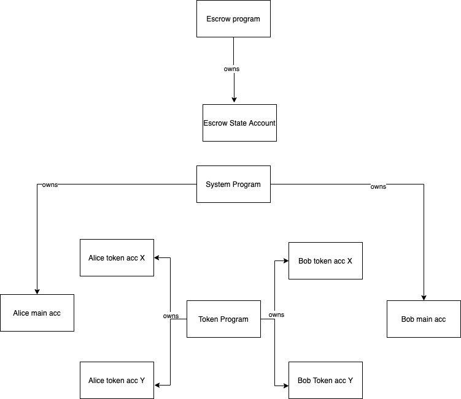
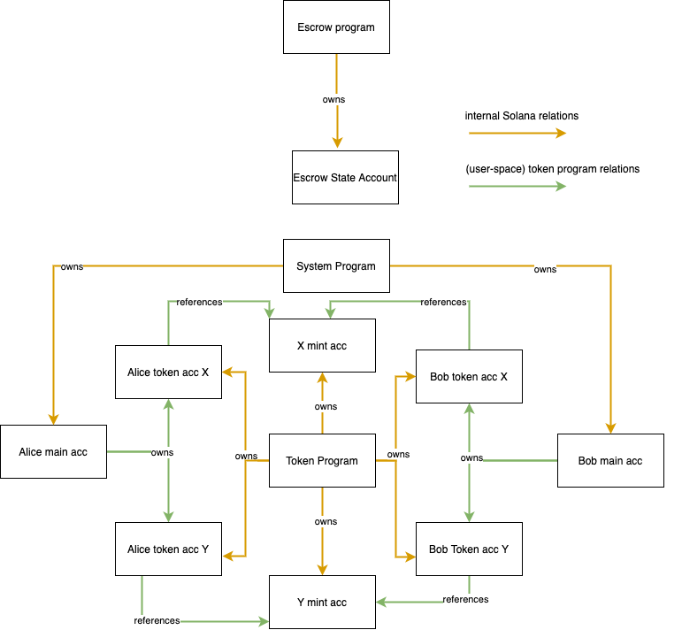
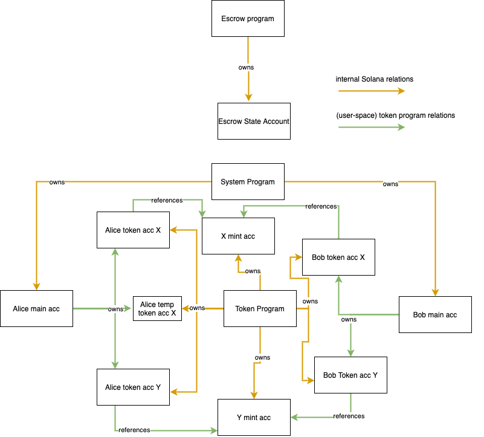

::: blog-meta
:::

## Intro
This guide is meant to serve as an intro to coding on [Solana](https://www.solana.com),
using an escrow program as an example. We'll go through the code together, building the escrow program step by step.

> On Solana, smart contracts are called _programs_.

The post switches between theory and practice often to keep it engaging. It requires no previous knowledge of Solana.
While this is not a Rust tutorial, I will link to the [Rust docs](https://doc.rust-lang.org/book) whenever I introduce a new concept.
I will also link to the relevant Solana docs although you don't have to read them to follow along.

## The Final Product

Before we start coding, let's look at the final product to understand what we are building: an escrow program.

### What is an escrow?
An escrow smart contract is a good example to look at and build because it highlights well what a blockchain makes possible while still being easy to understand, allowing us to focus on the code itself. For those unfamiliar with the concept, here is a brief explainer.


Imagine Alice has an asset _A_ and Bob has an asset _B_. They would like to trade their assets but neither wants to send their asset first. After all, what if the other party does not hold up their end of the trade and runs away with both assets? A deadlock will be reached where no party wants to send their asset first.

The traditional way to solve this problem is to introduce a third party _C_ which both _A_ and _B_ trust. _A_ or _B_ can now go first and send their asset to _C_. _C_ then waits for the other party to send their asset and only then does _C_ release both assets.

The blockchain way is to replace the trusted third party _C_ with code on a blockchain, specifically a smart contract that verifiably acts the same way a trusted third party would. A smart contract is superior to a trusted third party because of a number of reasons e.g. can you be sure that the trusted third party isn't colluding with the person on the other side of the trade? You can be with a smart contract, because you can look at the code before running it.

I'll end this background section here. The internet already has a lot of material on escrows on blockchains. Let's now look at how to build such an escrow on Solana.

## Building the escrow program

### Setting up the project
Head over to the [template repo](https://github.com/mvines/solana-bpf-program-template), click `Use this template`, and set up a repo. The Solana ecosystem is still young so this is what we've got for now. Additionally, go [here](https://docs.solana.com/cli/install-solana-cli-tools) to install the Solana dev tools.

If you don't know how to test solana programs yet, remove all the testing code. Testing programs is a topic for another blog post. Remove the testing code in `entrypoint.rs` as well as the `tests` folder next to `src`. Lastly, remove the testing dependencies from `Cargo.toml`. It should now look like this:

```toml
[package]
name = "solana-escrow"
version = "0.1.0"
edition = "2018"
license = "WTFPL"
publish = false

[dependencies]
solana-program = "1.5.0"

[lib]
crate-type = ["cdylib", "lib"]
```

### entrypoint.rs, programs, and accounts
Have a look into `lib.rs`. First, the required crates are brought into scope using [use](https://doc.rust-lang.org/stable/book/ch07-04-bringing-paths-into-scope-with-the-use-keyword.html). Then we use the `entrypoint!` [macro](https://doc.rust-lang.org/stable/book/ch19-06-macros.html) to declare the `process_instruction` the [entrypoint](https://docs.solana.com/developing/deployed-programs/developing-rust#program-entrypoint) to the program. Entrypoints are the only way to call a program; all calls go through the function declared as the entrypoint.

> Keep in mind that different [BPF loaders](https://docs.solana.com/developing/builtins/programs#bpf-loader) may require different entrypoints.

We can see that the BPF loader we are using requires the entrypoint function to take 3 arguments. `program_id` is simply the program id of the currently executing program. Why you'd want access to it inside the program will become apparent later. `intruction_data` is data passed to he program by the caller, it could be anything. Finally, to understand what `accounts` are, we have to dive deeper into the [solana programming model](https://docs.solana.com/developing/programming-model/overview). The reason we need accounts is because

> Solana programs are stateless

If you want to store state, use accounts. Programs themselves are stored in accounts which are marked `executable`. Each account can hold data and Sol.
Each account also has an `owner` and only the owner may debit the account and adjust its data. Crediting may be done by anyone. Here's an example of an [account](https://explorer.solana.com/address/6TkKqq15wXjqEjNg9zqTKADwuVATR9dW3rkNnsYme1ea). As you can see in the example account, it has its owner field set to the `System Program`. As a matter of fact,

> Accounts can only be owned by programs

Now you might be thinking "does that mean that my own SOL account is actually not owned by myself?". And you'd be right! But fear not, your funds are safu. The way it works is that even basic SOL transactions are handled by a program on Solana: the `system program`.


[If you look at the program](https://github.com/solana-labs/solana/blob/master/runtime/src/system_instruction_processor.rs#L181) you'll see that although the program owns all basic SOL accounts, it can only transfer SOL from an account when the transaction has been signed by the private key of the SOL account being debited. 

> In theory, programs have full autonomy over the accounts they own. It is up to the program's creator to limit this autonomy and up to the users of the program to verify the program's creator has really done so

We'll get to how a program can check whether a transaction has been signed and how a program becomes the owner of an account in a bit. Before we conclude the entrypoint section, there is one more thing to know.

> All accounts to be read or written to must be passed into the entrypoint function

This allows the runtime to parallelise transactions (among even more other things? I'm not sure here myself). If the runtime knows all the accounts that will be written to and read by everyone at all times it can run those transactions in parallel that do not touch the same accounts or touch the same accounts but only read and don't write. If a transaction violates this constraint and reads or writes to an account of which the runtime has not been notified, the transaction will fail.

Now, to finally conclude this section, create a new `entrypoint.rs` file next to `lib.rs` and move the lib code there. Finally, register the entrypoint module inside `lib.rs`.

``` rust
// inside lib.rs, only the following line should be in here
pub mod entrypoint;
```

#### theory recap

- each program has an entrypoint whose structure depends on which BPF Loader is used
- accounts are used to store state
- accounts are owned by programs
- only the account owner may debit an account and adjust its data
- all accounts to be written to or read must be passed into the entrypoint

### instruction.rs Part 1, general code structure, and the beginning of the escrow program flow

#### code structure

Next, create a file `instruction.rs` next to the other two and register it inside `lib.rs` like you did with the entrypoint. To understand the new file's purpose, let's look at a common way to structure a program's code and the way
we will structure our program as well.


```
.
├─ src
│  ├─ lib.rs
│  ├─ entrypoint.rs
│  ├─ instruction.rs
│  ├─ processor.rs
│  ├─ state.rs
│  ├─ error.rs
├─ .gitignore
├─ Cargo.lock
├─ Cargo.toml
├─ Xargo.toml
```

The flow of a program using this structure looks like this:

1. Someone calls the entrypoint
2. The entrypoint forwards the arguments to the processor
3. The processor asks `instruction.rs` to decode the `instruction_data` argument from the entrypoint function.
4. Using the decoded data, the processor will now decide which processing function to use to process the request.
5. The processor may use `state.rs` to encode state into or decode the state of an account which has been passed into the entrypoint.

As you can see,

> instruction.rs defines the API of the program

While there is only one entrypoint, program execution can follow different paths depending on the given instruction data that is decoded inside `instruction.rs`.

#### beginning of the escrow program flow

Let's now look at the different execution paths our program may take by zooming out and sketching the program flow for our escrow program.

Remember we have two parties _Alice_ and _Bob_ which means there are two `system_program` accounts. Because _Alice_ and _Bob_ want to transfer tokens,
we'll make use of - you guessed it! - the `token program`. This program assigns each token its own account. Both _Alice_ and _Bob_ need an account for each token (which we'll call X and Y), so we get 4 more accounts. Since escrow creation and the trade won't happen inside a single transaction, it's probably a good idea to have another account to save some escrow data. Note that this account is created for each exchange. For now, our world looks like this:



Now there are two questions you might ask yourself. How will Alice and Bob transfer ownership of X and Y respectively to the escrow and how are their main accs connected to their token accs?
To find an answer to these questions, we must briefly jump into the `token program`.

### The token program Part 1

#### token ownership

The naive way one might connect Alice's main account to her token accounts is by not connecting them at all. Whenever she wanted transfer a token, she'd use the private key
of the token account. Clearly, this would not be sustainable if Alice owned many tokens because that would require her to keep a private key for each token account.

It would be much easier for Alice if she just had one private key for all her token accounts and this is exactly how the token program does it!
It assigns each token account an owner. Note that this token account owner attribute is **not** the same as the account owner. The account owner is an internal Solana attribute that will always be a program. This new token owner attribute is something the token program declares in user space. It's encoded inside a token account's `data`, in addition to other properties such as the balance of tokens the account holds. What this also means is that once a token account has been set up, its private key is useless, only its token owner attribute matters. And the token owner attribute is going to be some other address, in our case Alice's and Bob's main account respectively. When making a token transfer they simply have to sign the tx with the private key of their main account.

> All internal Solana internal account information are saved into [fields on the account](https://docs.rs/solana-program/1.5.0/solana_program/account_info/struct.AccountInfo.html#fields) but never into the `data` field which is solely meant for user space information.

We can see all this when looking at a token account in the [explorer](https://explorer.solana.com/address/FpYU4M8oH9pfUqzpff44gsGso96MUKW1G1tBZ9Kxcb7d?cluster=mainnet-beta).

You've probably noticed the `mint` field in the explorer. This is how we know which token the token account belongs to. For each token there is 1 mint account that holds the token's metadata such as the supply. We'll need this field later to verify that the token accs Alice and Bob use really belong to asset X and Y and that neither party is sneaking in a wrong asset.

With all this in mind, we can create populate our world with more information:



Now we know how all those accounts are connected but we don't know yet how Alice can transfer tokens to the escrow. We'll cover this now.
#### transferring ownership

The only way to own units of a token is to own a token account that holds some token balance of the token referenced by the account's (user space) `mint` property. Hence, the escrow program will need an account to hold Alice's X tokens. One way of achieving this is to have Alice create a temporary X token account to which she transfers the X tokens she wants to trade. Then, using a function in the token program, she transfers (token-program) ownership of the temporary X token account to the escrow program. Let's add the temporary account to our escrow world. The image shows the escrow world _before_ Alice transfers token account ownership.



There is one more problem here. What exactly does Alice transfer ownership to? Enter [_Program Derived Addresses_](https://docs.solana.com/developing/programming-model/calling-between-programs#program-derived-addresses).

#### theory recap

- developers should use the `data` field to save data inside accounts
- the token program owns token accounts which - inside their `data` field - hold [relevant information](https://github.com/solana-labs/solana-program-library/blob/master/token/program/src/state.rs#L86
- the token program also owns token mint accounts with [relevant data](https://github.com/solana-labs/solana-program-library/blob/master/token/program/src/state.rs#L86)
- each token account holds a reference to their token mint account, thereby stating which token mint they belong to
- the token program allows the (user space) owner of a token account to transfer its ownership to another address

### Program Derived Addresses (PDAs) Part 1

Transferring ownership to the account the program is stored at is a bad idea. The program's deployer might have the private key to that address and you don't want them to own your funds. The question is then, can programs be given user space ownership of a token account?


The trick is to assign token account ownership to a _Program Derived Address_ of the escrow program. For now, it is enough for you to know this address exists and we can use it to let a program sign transactions or assign it user space ownership of accounts. We will cover PDAs in depth later but for now let's go back to coding!

### instruction.rs Part 2

We left off at `instruction.rs` with the knowledge that this file would define the API of the program but without having written any code yet. 
Let's start coding by adding an `InitEscrow` API endpoint.

``` rust
// inside instruction.rs
pub enum EscrowInstruction {

    /// Starts the trade by creating and populating an escrow account and transferring ownership of the given temp token account to the PDA
    ///
    ///
    /// Accounts expected:
    ///
    /// 0. `[signer]` The account of the person initializing the escrow
    /// 1. `[writable]` Temporary token account that should be created prior to this instruction and owned by the initializer
    /// 2. `[]` The initializer's token account for the token they will receive should the trade go through
    /// 3. `[writable]` The escrow account, it will hold all necessary info about the trade.
    /// 4. `[]` The token program
    InitEscrow {
        /// The amount party A expects to receive of token Y
        amount: u64
    }
}
```

Although `instruction.rs` does not touch accounts, it is helpful to define which accounts you expect here so all the required calling info is in one place and easy to find for others. Additionally, it's helpful to add required account properties inside brackets. Note that everything after the `///` is a comment an has no effect on the program, it's only there for documentation purposes. The `writable` property should remind you of the parallelisation I explained above. If the caller does not mark the account `writable` in their calling code but the program attempts to write to it, the transaction will fail.

Let me explain why the endpoint looks like it does:

```
0. `[signer]` The account of the person initializing the escrow
```
We need Account 0 and specifically Account 0 as a signer because transferring the ownership of the temporary account requires Alice's signature.
```
1. `[writable]` Temporary token account that should be created prior to this instruction and owned by the initializer
```
Account 1 is the temp token X account which needs to be writable. This is because changing token account ownership is a user space change which means the `data` field of the account will be changed
```
2. `[]` The initializer's token account for the token they will receive should the trade go through
```
Account 2 is Alice's token Y account. While it will be written to eventually, it won't happen in this transaction which is why we can leave the brackets empty (implying read-only)
```
3. `[writable]` The escrow account, it will hold all necessary info about the trade.
```
Account 3 is the escrow account which also needs to be writable because the program will write the escrow information into it
```
4. `[]` The token program
```
Account 4 is the account of the token program itself. I will explain why we need this account when we get to writing the processor code
``` rust
InitEscrow {
    /// The amount party A expects to receive of token Y
    amount: u64
}
```
Finally, the program requires the amount of token Y that Alice wants to receive for her X tokens. This amount is not provided through an account but through the `instruction_data`.

`instruction.rs` is responsible for decoding `instruction_data` so that's that we'll do next.

``` rust{2-4,24-45}
// inside instruction.rs
use std::convert::TryInto;
use crate::error::{EscrowError, EscrowError::InvalidInstruction};

 pub enum EscrowInstruction {

    /// Starts the trade by creating and populating an escrow account and transferring ownership of the given temp token account to the PDA
    ///
    ///
    /// Accounts expected:
    ///
    /// 0. `[signer]` The account of the person initializing the escrow
    /// 1. `[writable]` Temporary token account that should be created prior to this instruction and owned by the initializer
    /// 2. `[]` The initializer's token account for the token they will receive should the trade go through
    /// 3. `[writable]` The escrow account, it will hold all necessary info about the trade.
    /// 4. `[]` The token program
    InitEscrow {
        /// The amount party A expects to receive of token Y
        amount: u64
    }
}

impl EscrowInstruction {
    /// Unpacks a byte buffer into a [EscrowInstruction](enum.EscrowInstruction.html).
    pub fn unpack(input: &[u8]) -> Result<Self, EscrowError> {
        let (tag, rest) = input.split_first().ok_or(InvalidInstruction)?;

        Ok(match tag {
            0 => Self::InitEscrow {
                amount: unpack_amount(rest)?,
            },
            _ => return Err(InvalidInstruction),
        })
    }

    fn unpack_amount(input: &[u8]) -> Result<u64, EscrowError> {
        let amount = input
            .get(..8)
            .and_then(|slice| slice.try_into().ok())
            .map(u64::from_le_bytes)
            .ok_or(InvalidInstruction)?;
        Ok(amount)
    }
}
```

`unpack` expects a [reference](https://doc.rust-lang.org/stable/book/ch04-02-references-and-borrowing.html) to a slice of `u8`. It looks at the first byte to determine how to decode the rest of the slice. For now, we'll leave it at one instruction (ignoring the instruction where Bob takes the trade).

This won't compile because we are using an undefined error. Let's add that error next.

### error.rs

Create a new file `error.rs` next to the others and register it inside `lib.rs`. Then, add the following dependency to your `Cargo.toml`

``` toml
...
[dependencies]
thiserror = "1.0.21"
...
```

and the following code to `error.rs`.

``` rust
// inside error.rs
use thiserror::Error;

#[derive(Error)]
pub enum EscrowError {
    /// Invalid instruction
    #[error("Invalid Instruction")]
    InvalidInstruction,
}
```

What we are doing here is [defining an error type](https://doc.rust-lang.org/rust-by-example/error/multiple_error_types/define_error_type.html). Instead of having to write the `fmt::Display` implementation ourselves as is done in the example the link points to, we use the handy [thiserror](https://docs.rs/thiserror/1.0.22/thiserror/) library that does it for us using the `#[error("..")]` notation. This will become especially useful when we add more errors later on.
