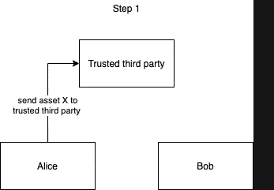
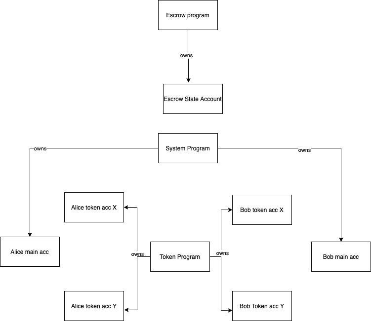

::: blog-meta
:::

## Intro & Motivation
This guide is meant to serve as an intro to coding on the [Solana](https://www.solana.com) Blockchain,
using an escrow program as an example. We'll go through the code together, building the escrow program step by step. I've also created a UI you will be able to use to try out your program. Additionally, you'll get to play with the (shameless plug) [spl-token-ui](https://www.spl-token-ui.com).

Most of the info in this blog post can be found somewhere in the docs or in example programs. Having said this, I have not found a guide that both walks through most of the coding theory step by step and applies it in practice. I hope this post achieves this, interweaving the theory and practice of solana programs. It requires no previous knowledge of Solana. While this is not a Rust tutorial, I will link to the [Rust docs](https://doc.rust-lang.org/book) whenever I introduce a new concept.
I will also link to the relevant Solana docs although you don't have to read them to follow along.

Important theory will be sprinkled into the post like this:

> On Solana, smart contracts are called _programs_

and at the end of each section summarized like this:

::: theory-recap
- On Solana, smart contracts are called _programs_
:::

I do not claim to explain _all_ topics but hope this will be a solid starting point from which the reader can explore Solana further. If you're new to Solana and Rust and want to finish this post without breaks and leave with a solid understanding of all concepts discussed and links mentioned I recommend allocating an entire day to the post.

If something is not working and you just cannot figure out why, have a look at the final code [here](https://github.com/paul-schaaf/solana-escrow).

If you find mistakes or would like to give feedback, please do contact me on discord [paulx#9059](https://discord.com/invite/pquxPsq).

## The Final Product

Before we start coding, let's look at the final product to understand what we are building: an escrow program.

### What is an escrow?
An escrow smart contract is a good example to look at and build because it highlights well what a blockchain makes possible while still being easy to understand, allowing us to focus on the code itself. For those unfamiliar with the concept, here is a brief explainer.

<div class="zoom-image">



</div>

Imagine Alice has an asset _A_ and Bob has an asset _B_. They would like to trade their assets but neither wants to send their asset first. After all, what if the other party does not hold up their end of the trade and runs away with both assets? A deadlock will be reached where no party wants to send their asset first.

The traditional way to solve this problem is to introduce a third party _C_ which both _A_ and _B_ trust. _A_ or _B_ can now go first and send their asset to _C_. _C_ then waits for the other party to send their asset and only then does _C_ release both assets.

The blockchain way is to replace the trusted third party _C_ with code on a blockchain, specifically a smart contract that verifiably acts the same way a trusted third party would. A smart contract is superior to a trusted third party because of a number of reasons e.g. can you be sure that the trusted third party isn't colluding with the person on the other side of the trade? You can be sure with a smart contract because you can look at the code before running it.

I'll end this background section here. The internet already has a lot of material on escrows on blockchains. Let's now look at how to build such an escrow on Solana.

## Building the escrow program - Alice's Transaction

### Setting up the project
Head over to the [template repo](https://github.com/mvines/solana-bpf-program-template), click `Use this template`, and set up a repo. The Solana ecosystem is still young so this is what we've got for now. Vscode with the Rust extension is what I use. You'll also need [`Rust`](https://www.rust-lang.org/tools/install). Additionally, go [here](https://docs.solana.com/cli/install-solana-cli-tools) to install the Solana dev tools. **You need at least version `1.5.2`**. (If you're on mac and there are no binaries for the version you want, follow the "build from source" section and add installed the bins to path. The `solana-install init` step is unnecessary and does not work, ignore it. If it doesn't build because a command cannot be found, try installing [_coreutils_](https://formulae.brew.sh/formula/coreutils) and [_binutils_](https://formulae.brew.sh/formula/binutils) with homebrew).

If you don't know how to test solana programs yet, remove all the testing code. Testing programs is a topic for another blog post. Remove the testing code in `lib.rs` as well as the `tests` folder next to `src`. Lastly, remove the testing dependencies from [`Cargo.toml`](https://doc.rust-lang.org/book/ch01-03-hello-cargo.html?highlight=cargo#creating-a-project-with-cargo). It should now look like this:

```toml
[package]
name = "solana-escrow"
version = "0.1.0"
edition = "2018"
license = "WTFPL"
publish = false

[dependencies]
solana-program = "1.5.0"

[lib]
crate-type = ["cdylib", "lib"]
```

### entrypoint.rs, programs, and accounts
Have a look into `lib.rs`. First, the required [crates](https://doc.rust-lang.org/book/ch07-01-packages-and-crates.html) are brought into scope using [use](https://doc.rust-lang.org/stable/book/ch07-04-bringing-paths-into-scope-with-the-use-keyword.html). Then we use the `entrypoint!` [macro](https://doc.rust-lang.org/stable/book/ch19-06-macros.html) to declare the `process_instruction` function the [entrypoint](https://docs.solana.com/developing/deployed-programs/developing-rust#program-entrypoint) to the program. Entrypoints are the only way to call a program; all calls go through the function declared as the entrypoint.

> When called, a program is passed to its [BPF Loader]((https://docs.solana.com/developing/builtins/programs#bpf-loader)) which processes the call. Different BPF loaders may require different entrypoints.

The reason for the existence of multiple BPF Loaders is that it itself is a program. If updates are made to the program, a new program version has to be deployed. We can see that the BPF loader we are using requires the entrypoint function to take 3 arguments. `program_id` is simply the program id of the currently executing program. Why you'd want access to it inside the program will become apparent later. `intruction_data` is data passed to the program by the caller, it could be anything. Finally, to understand what `accounts` are, we have to dive deeper into the [solana programming model](https://docs.solana.com/developing/programming-model/overview). The reason we need accounts is because

> Solana programs are stateless

If you want to store state, use [accounts](https://docs.solana.com/developing/programming-model/accounts). Programs themselves are stored in accounts which are marked `executable`. Each account can hold data and [SOL](https://docs.solana.com/terminology#sol).
Each account also has an `owner` and only the owner may debit the account and adjust its data. Crediting may be done by anyone. Here's an example of an [account](https://explorer.solana.com/address/6TkKqq15wXjqEjNg9zqTKADwuVATR9dW3rkNnsYme1ea). As you can see in the example account, it has its owner field set to the `System Program`. As a matter of fact,

> Accounts can only be owned by programs

Now you might be thinking "does that mean that my own SOL account is actually not owned by myself?". And you'd be right! But fear not, your funds are [safu](https://www.urbandictionary.com/define.php?term=Safu). The way it works is that even basic SOL transactions are handled by a program on Solana: the `system program`. (As a matter of fact, even programs are owned by programs. Remember, they are stored in accounts and these `executable` accounts are owned by the BPF Loader. The only programs not owned by the BPF loader are - of course - the BPF loader itself and the System Program. They are owned by the NativeLoader and have special privileges such as allocating memory or marking accounts as executable)

<div class="zoom-image">


</div>

[If you look at the system program](https://github.com/solana-labs/solana/blob/master/runtime/src/system_instruction_processor.rs#L179) you'll see that although the program owns all basic SOL accounts, it can only transfer SOL from an account when the transaction has been signed by the private key of the SOL account being debited.

> In theory, programs have full autonomy over the accounts they own. It is up to the program's creator to limit this autonomy and up to the users of the program to verify the program's creator has really done so

We'll get to how a program can check whether a transaction has been signed and how a program becomes the owner of an account in a bit. Before we conclude the entrypoint section, there is one more thing to know.

> All accounts to be read or written to must be passed into the entrypoint function

This allows the runtime to parallelise transactions. If the runtime knows all the accounts that will be written to and read by everyone at all times it can run those transactions in parallel that do not touch the same accounts or touch the same accounts but only read and don't write. If a transaction violates this constraint and reads or writes to an account of which the runtime has not been notified, the transaction will fail.

Now, to finally conclude this section, create a new `entrypoint.rs` file next to `lib.rs` and move the `lib.rs` code there. Finally, register the entrypoint module inside `lib.rs`. **You will have to do this for all files we create**.

``` rust
// inside lib.rs, only the following line should be in here
pub mod entrypoint;
```

::: theory-recap
- each program is processed by its BPF Loader and has an entrypoint whose structure depends on which BPF Loader is used
- accounts are used to store state
- accounts are owned by programs
- only the account owner may debit an account and adjust its data
- all accounts to be written to or read must be passed into the entrypoint
:::

### instruction.rs Part 1, general code structure, and the beginning of the escrow program flow

#### code structure

Next, create a file `instruction.rs` next to the other two and register it inside `lib.rs` like you did with the entrypoint. To understand the new file's purpose, let's look at a common way to structure a program's code and the way
we will structure our program as well.

```
.
├─ src
│  ├─ lib.rs -> registering modules
│  ├─ entrypoint.rs -> entrypoint to the program
│  ├─ instruction.rs -> program API, (de)serializing instruction data
│  ├─ processor.rs -> program logic
│  ├─ state.rs -> program objects, (de)serializing state
│  ├─ error.rs -> program specific errors
├─ .gitignore
├─ Cargo.lock
├─ Cargo.toml
├─ Xargo.toml
```

The flow of a program using this structure looks like this:

1. Someone calls the entrypoint
2. The entrypoint forwards the arguments to the processor
3. The processor asks `instruction.rs` to decode the `instruction_data` argument from the entrypoint function.
4. Using the decoded data, the processor will now decide which processing function to use to process the request.
5. The processor may use `state.rs` to encode state into or decode the state of an account which has been passed into the entrypoint.

As you can see,

> instruction.rs defines the "API" of a program

While there is only one entrypoint, program execution can follow different paths depending on the given instruction data that is decoded inside `instruction.rs`.

#### beginning of the escrow program flow

Let's now look at the different execution paths our program may take by zooming out and sketching the program flow for our escrow program.

Remember we have two parties _Alice_ and _Bob_ which means there are two `system_program` accounts. Because _Alice_ and _Bob_ want to transfer tokens,
we'll make use of - you guessed it! - the `token program`. In the token program, to hold a token, you need a token account. Both _Alice_ and _Bob_ need an account for each token (which we'll call X and Y), so we get 4 more accounts. Since escrow creation and the trade won't happen inside a single transaction, it's probably a good idea to have another account to save some escrow data. Note that this account is created for each exchange. For now, our world looks like this:

<div class="zoom-image">



</div>

Now there are two questions you might ask yourself. How will Alice and Bob transfer ownership of X and Y to the escrow respectively and how are their main accounts connected to their token accounts?
To find answers to these questions, we must briefly jump into the `token program`.

### The token program Part 1

#### token ownership

The naive way one might connect Alice's main account to her token accounts is by not connecting them at all. Whenever she wanted to transfer a token, she'd use the private key
of the token account. Clearly, this would not be sustainable if Alice owned many tokens because that would require her to keep a private key for each token account.

It would be much easier for Alice if she just had one private key for all her token accounts and this is exactly how the token program does it!
It assigns each token account an owner. Note that this token account owner attribute is **not** the same as the account owner. The account owner is an internal Solana attribute that will always be a program. This new token owner attribute is something the token program declares in user space (i.e. in the program they are building). It's encoded inside a token account's `data`, in addition to other properties such as the balance of tokens the account holds. What this also means is that once a token account has been set up, its private key is useless, only its token owner attribute matters. And the token owner attribute is going to be some other address, in our case Alice's and Bob's main account respectively. When making a token transfer they simply have to sign the tx (tx=transaction) with the private key of their main account.

> All internal Solana internal account information are saved into [fields on the account](https://docs.rs/solana-program/1.5.0/solana_program/account_info/struct.AccountInfo.html#fields) but never into the `data` field which is solely meant for user space information


We can see all this when looking at a token account in the [explorer](https://explorer.solana.com/address/FpYU4M8oH9pfUqzpff44gsGso96MUKW1G1tBZ9Kxcb7d?cluster=mainnet-beta). It parses the account's `data` property and displays its user space fields formatted properly.

You've probably noticed the `mint` field in the explorer. This is how we know which token the token account belongs to. For each token there is 1 mint account that holds the token's metadata such as the supply. We'll need this field later to verify that the token accounts Alice and Bob use really belong to asset X and Y and that neither party is sneaking in a wrong asset.

With all this in mind, we can populate our world with more information:

<div class="zoom-image">


</div>

Now we know how all those accounts are connected but we don't know yet how Alice can transfer tokens to the escrow. We'll cover this now.
#### transferring ownership

The only way to own units of a token is to own a token account that holds some token balance of the token referenced by the account's (user space) `mint` property. Hence, the escrow program will need an account to hold Alice's X tokens. One way of achieving this is to have Alice create a temporary X token account to which she transfers the X tokens she wants to trade (The token program sets no limit of how many token accounts for the same mint one may be the owner of). Then, using a function in the token program, she transfers (token-program) ownership of the temporary X token account to the escrow program. Let's add the temporary account to our escrow world. The image shows the escrow world _before_ Alice transfers token account ownership.

<div class="zoom-image">


</div>

There is one more problem here. What exactly does Alice transfer ownership to? Enter [_Program Derived Addresses_](https://docs.solana.com/developing/programming-model/calling-between-programs#program-derived-addresses).

::: theory-recap
- developers should use the `data` field to save data inside accounts
- the token program owns token accounts which - inside their `data` field - hold [relevant information](https://github.com/solana-labs/solana-program-library/blob/master/token/program/src/state.rs#L86)
- the token program also owns token mint accounts with [relevant data](https://github.com/solana-labs/solana-program-library/blob/master/token/program/src/state.rs#L86)
- each token account holds a reference to their token mint account, thereby stating which token mint they belong to
- the token program allows the (user space) owner of a token account to transfer its ownership to another address
- All internal Solana internal account information are saved into [fields on the account](https://docs.rs/solana-program/1.5.0/solana_program/account_info/struct.AccountInfo.html#fields) but never into the data field which is solely meant for user space information
:::

### Program Derived Addresses (PDAs) Part 1

We'd like some way for the program to own the X tokens while the escrow is open and waiting for Bob's transaction. The question is then, can programs be given user space ownership of a token account?

<div class="zoom-image">


</div>

The trick is to assign token account ownership to a _Program Derived Address_ (PDA) of the escrow program. For now, it is enough for you to know this address exists and we can use it to let a program sign transactions or assign it user space ownership of accounts. We will cover PDAs in depth later but for now let's go back to coding!

### instruction.rs Part 2

We left off at `instruction.rs` with the knowledge that this file would define the API of the program but without having written any code yet. 
Let's start coding by adding an `InitEscrow` API endpoint.

``` rust
// inside instruction.rs
pub enum EscrowInstruction {

    /// Starts the trade by creating and populating an escrow account and transferring ownership of the given temp token account to the PDA
    ///
    ///
    /// Accounts expected:
    ///
    /// 0. `[signer]` The account of the person initializing the escrow
    /// 1. `[writable]` Temporary token account that should be created prior to this instruction and owned by the initializer
    /// 2. `[]` The initializer's token account for the token they will receive should the trade go through
    /// 3. `[writable]` The escrow account, it will hold all necessary info about the trade.
    /// 4. `[]` The rent sysvar
    /// 5. `[]` The token program
    InitEscrow {
        /// The amount party A expects to receive of token Y
        amount: u64
    }
}
```

Although `instruction.rs` does not touch accounts, it is helpful to define which accounts you expect here so all the required calling info is in one place and easy to find for others. Additionally, it's helpful to add required account properties inside brackets. Note that everything after the `///` is a comment an has no effect on the program, it's only there for documentation purposes. The `writable` property should remind you of the parallelisation I explained above. If the caller does not mark the account `writable` in their calling code but the program attempts to write to it, the transaction will fail.

Let me explain why the endpoint looks like it does:

```
0. `[signer]` The account of the person initializing the escrow
```
We need Account 0 and specifically Account 0 as a signer because transferring the ownership of the temporary account requires Alice's signature. I'll be referring to Alice as the _initializer_ and Bob as the _taker_ in the code (Alice inits the escrow, Bob takes the trade. Pls let me know if you can come up with better naming)
```
1. `[writable]` Temporary token account that should be created prior to this instruction and owned by the initializer
```
Account 1 is the temp token X account which needs to be writable. This is because changing token account ownership is a user space change which means the `data` field of the account will be changed
```
2. `[]` The initializer's token account for the token they will receive should the trade go through
```
Account 2 is Alice's token Y account. While it will be written to eventually, it won't happen in this transaction which is why we can leave the brackets empty (implying read-only)
```
3. `[writable]` The escrow account, it will hold all necessary info about the trade.
```
Account 3 is the escrow account which also needs to be writable because the program will write the escrow information into it
```
4. `[]` The rent sysvar
```
Account 4 is the `Rent` sysvar. I'll explain this in detail once we get to writing the `processor` code. What you should remember for now is that 
```
5. `[]` The token program
```
Account 5 is the account of the token program itself. I will explain why we need this account as well when we get to writing the `processor` code

> Solana has sysvars that are parameters of the Solana cluster you are on. These sysvars can be accessed through accounts and store parameters such as what the current fee or rent is

``` rust
InitEscrow {
    /// The amount party A expects to receive of token Y
    amount: u64
}
```
Finally, the program requires the amount of token Y that Alice wants to receive for her X tokens. This amount is not provided through an account but through the `instruction_data`.

`instruction.rs` is responsible for decoding `instruction_data` so that's that we'll do next.

``` rust{2-5,26-47}
// inside instruction.rs
use std::convert::TryInto;
use solana_program::program_error::ProgramError;

use crate::error::EscrowError::InvalidInstruction;

 pub enum EscrowInstruction {

    /// Starts the trade by creating and populating an escrow account and transferring ownership of the given temp token account to the PDA
    ///
    ///
    /// Accounts expected:
    ///
    /// 0. `[signer]` The account of the person initializing the escrow
    /// 1. `[writable]` Temporary token account that should be created prior to this instruction and owned by the initializer
    /// 2. `[]` The initializer's token account for the token they will receive should the trade go through
    /// 3. `[writable]` The escrow account, it will hold all necessary info about the trade.
    /// 4. `[]` The rent sysvar
    /// 5. `[]` The token program
    InitEscrow {
        /// The amount party A expects to receive of token Y
        amount: u64
    }
}

impl EscrowInstruction {
    /// Unpacks a byte buffer into a [EscrowInstruction](enum.EscrowInstruction.html).
    pub fn unpack(input: &[u8]) -> Result<Self, ProgramError> {
        let (tag, rest) = input.split_first().ok_or(InvalidInstruction)?;

        Ok(match tag {
            0 => Self::InitEscrow {
                amount: Self::unpack_amount(rest)?,
            },
            _ => return Err(InvalidInstruction.into()),
        })
    }

    fn unpack_amount(input: &[u8]) -> Result<u64, ProgramError> {
        let amount = input
            .get(..8)
            .and_then(|slice| slice.try_into().ok())
            .map(u64::from_le_bytes)
            .ok_or(InvalidInstruction)?;
        Ok(amount)
    }
}
```

`unpack` expects a [reference](https://doc.rust-lang.org/stable/book/ch04-02-references-and-borrowing.html) to a slice of `u8`. It looks at the first byte (=`tag`) to determine how to decode (using [`match`](https://doc.rust-lang.org/rust-by-example/flow_control/match.html)) the rest (=`rest`) of the slice. For now, we'll leave it at one instruction (ignoring the instruction where Bob takes the trade). `unpack_amount` decodes the `rest` to get a `u64` representing the `amount`. You can look up the individual functions yourself. What's most important for now is that you understand what is going on at a high level in the unpack function: 1. choose which instruction to build 2. build and return that instruction.

This won't compile because we are using an undefined error. Let's add that error next.

::: theory-recap
- Solana has sysvars that are parameters of the Solana cluster you are on. These sysvars are stored in accounts and store parameters such as what the current fee or rent is
:::

### error.rs

Create a new file `error.rs` next to the others and register it inside `lib.rs`. Then, add the following dependency to your `Cargo.toml`

``` toml {4}
...
[dependencies]
solana-program = "1.5.0"
thiserror = "1.0.21"
```

and the following code to `error.rs`.

``` rust
// inside error.rs
use thiserror::Error;

#[derive(Error, Debug, Copy, Clone)]
pub enum EscrowError {
    /// Invalid instruction
    #[error("Invalid Instruction")]
    InvalidInstruction,
}
```

What we are doing here is [defining an error type](https://doc.rust-lang.org/rust-by-example/error/multiple_error_types/define_error_type.html). Instead of having to write the `fmt::Display` implementation ourselves as is done in the example the link points to, we use the handy [thiserror](https://docs.rs/thiserror/1.0.22/thiserror/) library that does it for us using the [`#[error("..")]`](https://doc.rust-lang.org/book/ch19-06-macros.html?highlight=derive#how-to-write-a-custom-derive-macro) notation. This will become especially useful when we add more errors later on.

Looking back into `instruction.rs`, we can see that we are not quite done. The compiler is telling us it has no way of turning an EscrowError into a ProgramError ("the trait `std::convert::From<error::EscrowError>` is not implemented for `solana_program::program_error::ProgramError`"). So let's implement a way.

``` rust{4,13-17}
// inside error.rs
use thiserror::Error;

use solana_program::program_error::ProgramError;

#[derive(Error, Debug, Copy, Clone)]
pub enum EscrowError {
    /// Invalid instruction
    #[error("Invalid Instruction")]
    InvalidInstruction,
}

impl From<EscrowError> for ProgramError {
    fn from(e: EscrowError) -> Self {
        ProgramError::Custom(e as u32)
    }
}
```

Let's stop for a moment to understand what is happening here. We are implementing a _generic trait_, specifically the [`From`](https://doc.rust-lang.org/std/convert/trait.From.html) trait which the `?` operator wants to use. To implement this trait we have to implement the `from` function which carries out the conversion. The `ProgramError` enum provides the `Custom` variant that allows us to convert from our program's `EscrowError` to a `ProgramError`.

The reason we do this conversion in the first place is that the entrypoint returns a `Result` of either nothing or a `ProgramError`.

### processor.rs Part 1, Rent Part 1, starting to process the InitEscrow instruction

#### pub fn process

After creating the entrypoint, an InitEscrow endpoint, and our first error, we can finally move on to code `processor.rs`. This is where the magic happens.
Start by creating `processor.rs` and registering it inside `lib.rs`. Then paste the following into `processor.rs`.

``` rust
use solana_program::{
    account_info::AccountInfo,
    entrypoint::ProgramResult,
    msg,
    pubkey::Pubkey,
};

use crate::instruction::EscrowInstruction;

pub struct Processor;
impl Processor {
    pub fn process(program_id: &Pubkey, accounts: &[AccountInfo], instruction_data: &[u8]) -> ProgramResult {
        let instruction = EscrowInstruction::unpack(instruction_data)?;

        match instruction {
            EscrowInstruction::InitEscrow { amount } => {
                msg!("Instruction: InitEscrow");
                Self::process_init_escrow(accounts, amount, program_id);
            }
        };
    }
}
```

Let's start unpacking what's happening. First, we pass the reference to the slice holding the `instruction_data` from `entrypoint.rs` into the `unpack` function we created earlier ([Note the `?` after the function call](https://doc.rust-lang.org/book/ch09-02-recoverable-errors-with-result.html?highlight=question,mark#a-shortcut-for-propagating-errors-the--operator)). We use `match` to figure out which processing function to call. Trivial, for now. `msg!` logs where we are going.

#### fn process_init_escrow


``` rust
use solana_program::{
    account_info::{next_account_info, AccountInfo},
    entrypoint::ProgramResult,
    program_error::ProgramError,
    msg,
    pubkey::Pubkey,
};
...
impl Processor {
    pub fn process{...}
    
    fn process_init_escrow(
        accounts: &[AccountInfo],
        amount: u64,
        program_id: &Pubkey,
    ) -> ProgramResult {
        let account_info_iter = &mut accounts.iter();
        let initializer = next_account_info(account_info_iter)?;

        if !initializer.is_signer {
            return Err(ProgramError::MissingRequiredSignature);
        }

        Ok(())
    }
}
```

`process_init_escrow` is next. To be clear, `...` just means there is other stuff around the code you're seeing, don't copy those! Copy and replace your current `use solana_program...` with the one here or add the invididual missing pieces.

Inside `process_init_escrow` we first create an iterator of accounts. It needs to be mutable so we can take elements out of it. The first account we expect - as defined in `instruction.rs` - is the escrow's initializer, i.e. Alice's main account. She needs to be a signer which we check right away. It's just a boolean field on `AccountInfo`.

``` rust {14-19}
...
fn process_init_escrow(
    accounts: &[AccountInfo],
    amount: u64,
    program_id: &Pubkey,
) -> ProgramResult {
    let account_info_iter = &mut accounts.iter();
    let initializer = next_account_info(account_info_iter)?;

    if !initializer.is_signer {
        return Err(ProgramError::MissingRequiredSignature);
    }

    let temp_token_account = next_account_info(account_info_iter)?;

    let token_to_receive_account = next_account_info(account_info_iter)?;
    if *token_to_receive_account.owner != spl_token::id() {
        return Err(ProgramError::IncorrectProgramId);
    }

    Ok(())
}
...
```

Next, add the highlighted lines. The temporary token account needs to be writable but there is no need to explicitly check this. The transaction will fail automatically should Alice not mark the account as writable.

You might ask yourself, "why do we check that the `token_to_receive_account` is actually owned by the token program but don't do the same for the `temp_token_account`?". The answer is that later on in the function we will ask the token program to transfer ownership of the `temp_token_account` to the _PDA_. This transfer will fail if the `temp_token_account` is not owned by the token program, because - as I'm sure you remember - only programs that own accounts may change accounts. Hence, there is no need for us to add another check here.

We don't make any changes to the `token_to_receive_account` though (inside Alice's transaction). We will just save it into the escrow data so that when Bob takes the trade, the escrow will know where to send asset Y. Thus, for this account, we should add a check. Note that nothing terrible would happen if we didn't. Instead of Alice's transaction failing because of our added check, Bob's would fail because the token program will attempt to send the Y tokens to Alice but not be the owner of the `token_to_receive_account`. That said, it seems more reasonable to let the tx fail that actually led to the invalid state.

Finally, I'm sure you have noticed that we are using a crate here which we have not registered inside `Cargo.toml` yet. Let's do that now.
``` toml{4}
[dependencies]
solana-program = "1.5.0"
thiserror = "1.0.21"
spl-token = {version = "3.0.1", features = ["no-entrypoint"]}
```

We are using a slighly different way to import a dependency here than we did we the other dependencies. That's because we are importing another Solana program that has its own entrypoint. But our program should only have one entrypoint, the one we defined earlier. Luckily, the token program provides a switch to turn its entrypoint off with the help of a [cargo feature](https://doc.rust-lang.org/cargo/reference/features.html). We should define this feature in our program as well so others can import our program! I'll leave this to you with some hints: Check out the [token program's](https://github.com/solana-labs/solana-program-library/tree/master/token/program) `Cargo.toml` and its `lib.rs`. If you cannot or don't want to figure it out on your own, you can take a look into the escrow program I created.

Now back to `processor.rs`. Copy and replace the `solana_program` use statement and add more code to `process_init_escrow`:


``` rust {19-29}
use solana_program::{
    account_info::{next_account_info, AccountInfo},
    entrypoint::ProgramResult,
    program_error::ProgramError,
    msg,
    pubkey::Pubkey,
    program_pack::{Pack, IsInitialized},
    sysvar::{rent::Rent, Sysvar},
};
//inside process_init_escrow
...
let temp_token_account = next_account_info(account_info_iter)?;

let token_to_receive_account = next_account_info(account_info_iter)?;
if *token_to_receive_account.owner != spl_token::id() {
    return Err(ProgramError::IncorrectProgramId);
}

let escrow_account = next_account_info(account_info_iter)?;
let rent = &Rent::from_account_info(next_account_info(account_info_iter)?)?;

if !rent.is_exempt(escrow_account.lamports(), escrow_account.data_len()) {
    return Err(EscrowError::NotRentExempt.into());
}

let mut escrow_info = Escrow::unpack_unchecked(&escrow_account.data.borrow())?;
if escrow_info.is_initialized() {
    return Err(ProgramError::AccountAlreadyInitialized);
}

Ok(())
...
```
Now we see the [`Rent`](https://docs.solana.com/implemented-proposals/rent) sysvar in action. Let me explain:

> Rent is deducted from an account's balance according to their space requirements (i.e. the space an account and its fields take up in memory) regularly. An account can, however, be made rent-exempt if its balance is higher than some threshold that depends on the space it's consuming

Most of the time, you want your accounts to be rent-exempt, cause once their balance goes to zero, they _disappear_. More on this at the end of Bob's transaction.

Also, make sure to add the new error variant inside `error.rs` and adjust the use statement:

From
``` rust
use crate::instruction::EscrowInstruction;
```

To
``` rust
use crate::{instruction::EscrowInstruction, error::EscrowError};
```

Another unfamiliar thing is happening here. For the first time, we are accessing the `data` field. Because `data` is also just an array of `u8`, we need to deserialize it with `Escrow::unpack_unchecked`. This is a function inside `state.rs` which we'll create in the next section.

::: theory-recap
- Rent is deducted from an account's balance according to their space requirements regularly. An account can, however, be made rent-exempt if its balance is higher than some threshold that depends on the space it's consuming
:::

### state.rs

Create `state.rs` and register it inside `lib.rs`. The state file is responsible for 1) defining state objects that the processor can use 2) serializing and deserializing such objects from and into arrays of `u8` respectively.

Start by adding the following to `state.rs`.

``` rust
use solana_program::pubkey::Pubkey;

pub struct Escrow {
    pub is_initialized: bool,
    pub initializer_pubkey: Pubkey,
    pub temp_token_account_pubkey: Pubkey,
    pub initializer_token_to_receive_account_pubkey: Pubkey,
    pub expected_amount: u64,
}
```

We need to save `temp_token_account_pubkey` so that when Bob takes the trade, the escrow program can send tokens from the account at `temp_token_account_pubkey` to Bob's account. We already know that Bob will have to pass in the account into his entrypoint call eventually so why do we save it here? First, if we save its public key here, Bob can easily find the address of the accounts he needs to pass into the entrypoint. Otherwise Alice would have to send him not only the escrow acount address but also all her account addresses. Secondly, and more important for security is that Bob could pass in a different token account. Nothing stops him from doing so if we don't add a check requiring him to pass in the account with `temp_token_account_pubkey` as its public key. And to add that check later in the processor, we need the InitEscrow instruction to save the `temp_token_account_pubkey`.

> When writing Solana programs, be mindful of the fact that any accounts may be passed into the entrypoint, including different ones than those defined in the API inside `instruction.rs`. It's the program's responsibility to check that `received accounts == expected accounts`

`initializer_token_to_receive_account_pubkey` needs to be saved so that when Bob takes the trade, his tokens can be sent to that account. `expected_amount` will be used to check that Bob sends enough of his token. That leaves `initializer_pubkey` and `is_initialized`. I'll explain the latter now and the former later on.

We use `is_initialized` to determine whether a given escrow account is already in use. This, serialization, and deserialization are all standardized in the [traits](https://doc.rust-lang.org/book/ch10-02-traits.html) of the [`program pack` module](https://docs.rs/solana-program/1.5.0/solana_program/program_pack/index.html). First, implement `Sealed` and `IsInitialized`. 

``` rust
// inside state.rs
use solana_program::{
    program_pack::{IsInitialized, Pack, Sealed},
    pubkey::Pubkey,
};
...
impl Sealed for Escrow {}

impl IsInitialized for Escrow {
    fn is_initialized(&self) -> bool {
        self.is_initialized
    }
}
```

`Sealed` is just Solana's version of Rust's `Sized` trait although there does not seem to be any difference between the two.
Now, `Pack`, which relies on `Sealed` and in our case also on `IsInitialized` being implemented. It's a big but simple block of code. I'll split it into 2 parts. Let's start with the first one (you can copy and replace the `use` imports again):

``` rust
// inside state.rs
use solana_program::{
    program_pack::{IsInitialized, Pack, Sealed},
    program_error::ProgramError,
    pubkey::Pubkey,
};

use arrayref::{array_mut_ref, array_ref, array_refs, mut_array_refs};
...
impl Pack for Escrow {
    const LEN: usize = 105;
    fn unpack_from_slice(src: &[u8]) -> Result<Self, ProgramError> {
        let src = array_ref![src, 0, Escrow::LEN];
        let (
            is_initialized,
            initializer_pubkey,
            temp_token_account_pubkey,
            initializer_token_to_receive_account_pubkey,
            expected_amount,
        ) = array_refs![src, 1, 32, 32, 32, 8];
        let is_initialized = match is_initialized {
            [0] => false,
            [1] => true,
            _ => return Err(ProgramError::InvalidAccountData),
        };

        Ok(Escrow {
            is_initialized,
            initializer_pubkey: Pubkey::new_from_array(*initializer_pubkey),
            temp_token_account_pubkey: Pubkey::new_from_array(*temp_token_account_pubkey),
            initializer_token_to_receive_account_pubkey: Pubkey::new_from_array(*initializer_token_to_receive_account_pubkey),
            expected_amount: u64::from_le_bytes(*expected_amount),
        })
    }
}
```

The first requirement for something implementing `Pack` is defining `LEN` which is the size of our type. Looking at our Escrow struct, we can see how to calculate the length of the struct by adding the sizes of the individual data types: `1 (bool) + 3 * 32 (Pubkey) + 1 * 8 (u64) = 105`.  It's okay to use an entire `u8` for the bool since it'll make our coding easier and the cost of those extra wasted bits is infinitesimal.

After defining the escrow's length, we implement `unpack_from_slice` which turns an array of `u8` into an instance of the Escrow struct we defined above. Nothing too interesting happens here. Notable here is the use of [arrayref](https://docs.rs/arrayref/0.3.6/arrayref/), a library for getting references to sections of a slice. The docs should be enough to understand the (just 4) different functions from the library. Make sure to add the library to `Cargo.toml`.

``` toml
...
[dependencies]
...
arrayref = "0.3.6"
...
```

We can now deserialize state, serialization is next.

``` rust
...
impl Pack for Escrow {
    ...
    fn pack_into_slice(&self, dst: &mut [u8]) {
        let dst = array_mut_ref![dst, 0, Escrow::LEN];
        let (
            is_initialized_dst,
            initializer_pubkey_dst,
            temp_token_account_pubkey_dst,
            initializer_token_to_receive_account_pubkey_dst,
            expected_amount_dst,
        ) = mut_array_refs![dst, 1, 32, 32, 32, 8];

        let Escrow {
            is_initialized,
            initializer_pubkey,
            temp_token_account_pubkey,
            initializer_token_to_receive_account_pubkey,
            expected_amount,
        } = self;

        is_initialized_dst[0] = *is_initialized as u8;
        initializer_pubkey_dst.copy_from_slice(initializer_pubkey.as_ref());
        temp_token_account_pubkey_dst.copy_from_slice(temp_token_account_pubkey.as_ref());
        initializer_token_to_receive_account_pubkey_dst.copy_from_slice(initializer_token_to_receive_account_pubkey.as_ref());
        *expected_amount_dst = expected_amount.to_le_bytes();
    }
}
```

This is pretty much the same as the `unpack_from_slice` function, just vice versa! This time, we also pass in `&self`. We didn't have to do this inside `unpack_from_slice` because _there was no self_ yet. `unpack_from_slice` was a static constructor function returning a new instance of an escrow struct. When we `pack_into_slice`, we already have an instance of an Escrow struct and now serialize it into the given `dst` slice. And that's it for `state.rs`! But wait, if we look back into `processor.rs`, we call `unpack_unchecked`, a function we didn't define, so where is it coming from? The answer is that traits can have default functions that may be overridden but don't have to be.
[Look here](https://docs.rs/solana-program/1.5.0/src/solana_program/program_pack.rs.html#29-39) to find out about `Pack`'s default functions. 

With `state.rs` done, let's go back to the `processor.rs` and adjust one of our `use` statements.
 
From
``` rust
use crate::{instruction::EscrowInstruction, error::EscrowError};
``` 
to 
``` rust
use crate::{instruction::EscrowInstruction, error::EscrowError, state::Escrow};
```

### Processor Part 2, PDAs Part 2, CPIs Part 1

Let's finish the `process_init_escrow` function by first adding the state serialization. We've already created the escrow struct instance and checked that it is indeed uninitialized. Time to populate the struct's fields!

``` rust {8-14}
// inside process_init_escrow
...
let mut escrow_info = Escrow::unpack_unchecked(&escrow_account.data.borrow())?;
if escrow_info.is_initialized() {
    return Err(ProgramError::AccountAlreadyInitialized);
}

escrow_info.is_initialized = true;
escrow_info.initializer_pubkey = *initializer.key;
escrow_info.temp_token_account_pubkey = *temp_token_account.key;
escrow_info.initializer_token_to_receive_account_pubkey = *token_to_receive_account.key;
escrow_info.expected_amount = amount;

Escrow::pack(escrow_info, &mut escrow_account.data.borrow_mut())?;
```

Pretty straightforward. `pack` is another default function which internally calls our `pack_into_slice` function. 

#### PDAs Part 2

There's one thing left to do inside `process_init_escrow`: transferring (user space) ownership of the temporary token account to the PDA. This is a good time to explain what PDAs actually are and why we might need the `program_id` inside a process function. Copy and look at the higlighted line:

``` rust {5}
// inside process_init_escrow
...
escrow_info.expected_amount = amount;
Escrow::pack(escrow_info, &mut escrow_account.data.borrow_mut())?;
let (pda, _nonce) = Pubkey::find_program_address(&[b"escrow"], program_id);
```


We create a PDA by passing in an array of seeds and the `program_id` into the `find_program_address` function. We get back a new `pda` and `nonce` (you can ignore the nonce for now) with a 1/(2^255) chance the function fails ([2^255 is a BIG number](https://youtu.be/S9JGmA5_unY)). In our case the seeds can be static. There are cases such as in the [Associated Token Account program](https://github.com/solana-labs/solana-program-library/blob/596700b6b100902cde33db0f65ca123a6333fa58/associated-token-account/program/src/lib.rs#L24) where they aren't (cause different users should own different associated token accounts). We just need `1` PDA that can own `N` temporary token accounts for different escrows occuring at any and possibly the same point in time.

Ok, but what _is_ a PDA? Normally, Solana key pairs use the [`ed25519`](http://ed25519.cr.yp.to/) standard. This means normal public keys lie on the `ed25519` elliptic curve. PDAs are public keys that are derived from the `program_id` and the seeds as well as _having been pushed off the curve by the nonce_. Hence,

> Program Derived Addresses do not lie on the `ed25519` curve and therefore have no private key associated with them.

<div style="display: flex; justify-content: center" class="zoom-image">


</div>

A PDA is just a random array of bytes with the only defining feature being that they are _not_ on that curve. That said, they can still be used as normal addresses most of the time. You should absolutely read the two different docs on PDAs ([here](https://docs.solana.com/developing/programming-model/calling-between-programs#program-derived-addresses) and [here(find_program_address calls this function)](https://docs.rs/solana-program/1.5.0/src/solana_program/pubkey.rs.html#114)). We don't use the nonce here yet (also indicated by the underscore before the variable name). We will do that when we look into how it's possible to sign messages with PDAs even without a private key in PDAs Part 3 inside Bob's transaction.

#### CPIs Part 1

For now, let's look at how we can transfer the (user space) ownership of the temporary token account to the PDA. To do this, we will call the token program from our escrow program. This is called a [_Cross-Program Invocation_](https://docs.solana.com/developing/programming-model/calling-between-programs#cross-program-invocations) and executed using either the `invoke` or the `invoke_signed` function. Here we use `invoke`. In Bob's transaction we will use `invoke_signed`. The difference will become clear then. `invoke` takes two arguments: an instruction and an array of accounts.

``` rust
use solana_program::{
    account_info::{next_account_info, AccountInfo},
    entrypoint::ProgramResult,
    program_error::ProgramError,
    msg,
    pubkey::Pubkey,
    program_pack::{Pack, IsInitialized},
    sysvar::{rent::Rent, Sysvar},
    program::invoke
};
// inside process_init_escrow
...
let token_program = next_account_info(account_info_iter)?;
let owner_change_ix = spl_token::instruction::set_authority(
    token_program.key,
    temp_token_account.key,
    Some(&pda),
    spl_token::instruction::AuthorityType::AccountOwner,
    initializer.key,
    &[&initializer.key],
)?;

msg!("Calling the token program to transfer token account ownership...");
invoke(
    &owner_change_ix,
    &[
        temp_token_account.clone(),
        initializer.clone(),
        token_program.clone(),
    ],
)?;

Ok(())
// end of process_init_escrow
```

Copy and replace the `solana_program` use statement. We continue with `process_init_escrow` by getting the token_program account. It's a rule that the program being called through a CPI must be included as an account in the 2nd argument of `invoke` (and `invoke_signed`). Next, we create the instruction. This is just the instruction that the token program would expect were we executing a normal call. The token program defines some helper functions inside its `instruction.rs` that we can make use of. Of particular interest to us is the `set_token_authority` function which is a builder function to create such an instruction. We pass in the token program id, then the account whose authority we'd like to change, the account that's the new authority (in our case the PDA), the type of authority change (there are different authority types for token accounts, we care about changing the owner), the current account owner (Alice -> initializer.key), and finally the public keys signing the CPI.

The concept that is being used here is [_Signature Extension_](https://docs.solana.com/developing/programming-model/calling-between-programs#instructions-that-require-privileges). In short,

> When including a `signed` account in a program call, in all CPIs including that account made by that program inside the current instruction, the account will also be `signed`, i.e. the _signature is extended_ to the CPIs.

In our case this means that because Alice signed the `InitEscrow` transaction, the program can make the token program `set_authority` CPI and include her pubkey as a signer pubkey. This is necessary because changing a token account's owner should of course require the approval of the current owner.

Next to the instruction, we also need to pass in the accounts that are required by the instruction, in addition to the account of the program we are calling. You can look these up by going to the token programs `instruction.rs` and finding the setAuthority Enum whose comments will tell you which accounts are required (in our case, the current Owner's account and the account whose owner is to be changed).

Finally, adjust `entrypoint.rs` so it looks like this:
``` rust
use solana_program::{
    account_info::AccountInfo, entrypoint, entrypoint::ProgramResult, pubkey::Pubkey
};

use crate::processor::Processor;

entrypoint!(process_instruction);
fn process_instruction(
    program_id: &Pubkey,
    accounts: &[AccountInfo],
    instruction_data: &[u8],
) -> ProgramResult {
    Processor::process(program_id, accounts, instruction_data)
}
```

::: theory-recap
- Program Derived Addresses do not lie on the `ed25519` curve and therefore have no private key associated with them.
- When including a `signed` account in a program call, in all CPIs including that account made by that program inside the current instruction, the account will also be `signed`, i.e. the _signature is extended_ to the CPIs.
:::

### Trying out the program, understanding Alice's transaction

Because we've built a part of the program that is complete in itself, we can now try it out! In doing so, we can acquire more knowledge about Solana, e.g. where do accounts come from?

You can use this UI to try out your program. I explain how it works and what you need to do to make it work below. Feel free to build your own!

<iframe style="width:100%; height: 860px" frameborder="0" src="https://escrow-ui.netlify.app" title="Escrow - Alice's tx"></iframe>


#### Deploying your program on localnet
First, use the `cargo build-bpf` command to compile your program to a file with the `so` file extension.

Run `solana-keygen new` to create and save a solana keypair locally. (or [create a cli wallet](https://docs.solana.com/wallet-guide/cli) of your choosing.)

Fire up your localnet with the command (that should now be in your PATH) `solana-test-validator`. When calling `solana config get`, your "RPC URL" should now equal `http://localhost:8899`. If not, run `solana config set --url http://localhost:8899`. Running `solana balance` will show your balance which should NOT be 0. If it is, stop the validators, make sure you have created a key with `solana-keygen new` and start it again from genesis with `solana-test-validator -r`.

Then, use the `solana deploy` command to deploy the program to localnet. The path to the program will have been printed by `cargo build-bpf`.
(:warning: you can only deploy the program locally for now because we are using functionality that is not enabled on any cluster yet)

``` shell
solana deploy PATH_TO_YOUR_PROGRAM
```

The `deploy` command should print the program id which you can now paste into the UI above.

#### Creating a throwaway private key

My UI requires a private key (NEVER DO THIS IN A REAL APP). Go to [sollet.io](https://www.sollet.io) and create an entirely new account or a new account next to your main account. This account will represent Alice.

Change the sollet cluster to localnet.

After creating the wallet, airdrop yourself some SOL to pay for the tx fees. Then, click on `export` to export your Base58 encoded private key and paste it above.

Use your throwaway wallet for the next steps as well.

#### Creating tokens for testing on localnet

You'll also need a token to put into the escrow so head over to the [SPL Token UI](https://www.spl-token-ui.com). Make sure you choose *localnet* here too.

During the next steps, you will create the token mint accounts for X and Y and 2 token accounts, Alice's X and Alice's Y account. After creating each token account (not the token mint account!), copy the account address and put it into the appropriate UI field. You could also write them down somewhere else so can reuse them when eventually testing the entire escrow, including Bob's transaction.

Start by heading over to `Create new token` inside the `Tokens` tab. Fill out the mint authority with your sollet pubkey and create the new token. Keep in mind, this is the _token mint account_ for token X, i.e. the account that holds all the metadata of the token e.g. its supply and who is allowed to mint it (if you set the mint authority correctly, that should be your sollet pubkey! You can verify this in the explorer).

Next, go to `Create account` inside the `Accounts` tab and fill in the address of the token you just created and use your sollet pubkey as the account owner. Create an account (doesn't matter whether it's associated or not). This is Alice's token X token account.

Then, go to `Edit account` inside the `Accounts` tab. The `mint` option is selected by default. Put in Alice's token X token account (the one you just created) as the destination account and some number in the amount field. Click `Mint to account`.

Go through the same steps for token Y. You don't have to mint tokens to Alice's token Y account.

#### Creating the escrow

With all the steps completed, all that is left to do is to fill in Alice's expected amount and the amount she wants to put into the escrow. Fill in both numbers (the 2nd needs to be lower than what you minted to Alice's account) and hit `Init Escrow`.

#### Understanding what just happened, Rent Part 2, and Commitment

<div style="margin-top: 1.5rem">
    <Slideshow :images="[
        '/images/escrow-alice-initial.jpg',
        '/images/escrow-alice-ix1.jpg',
        '/images/escrow-alice-ix2-1.jpg',
        '/images/escrow-alice-ix2-2.jpg',
        '/images/escrow-alice-ix3.jpg',
        '/images/escrow-alice-ix4.jpg',
        '/images/escrow-alice-ix5-1.jpg',
        '/images/escrow-alice-ix5-2.jpg',
        '/images/escrow-alice-end.jpg'
    ]"/>
</div>

I've created a little slideshow to show the life of the transaction that Alice sends off. I've left out the internal and user space relationship arrows not to make the images too convoluted.

As you can see in the top right corner,

> there can be several _instructions_ (ix) inside one _transaction_ (tx) in Solana. These instructions are executed out _synchronously_ and the tx as a whole is executed _atomically_

This means that if a single instruction fails, the entire transaction fails. Right in ix1, we can see how accounts come to life.

> The system program is responsible for allocating account space and assigning (internal - not user space) account ownership

Alice's transaction consists of 5 instructions.

```
1. create empty account owned by token program
2. initialize empty account as Alice's X token account
3. transfer X tokens from Alice's main X token account to her temporary X token account
4. create empty account owned by escrow program
5. initialize empty account as escrow state and transfer temporary X token account ownership to PDA
```

As you can see,

> instructions may depend on previous instructions inside the same transaction

I'll now walk you through the important parts of the frontend code which uses the Solana js/ts libraries. Feel free to look at [the code](https://github.com/paul-schaaf/escrow-ui/blob/master/src/util/initEscrow.ts) yourself. 

``` ts
const tempTokenAccount = new Account();
const createTempTokenAccountIx = SystemProgram.createAccount({
    programId: TOKEN_PROGRAM_ID,
    space: AccountLayout.span,
    lamports: await connection.getMinimumBalanceForRentExemption(AccountLayout.span, 'singleGossip'),
    fromPubkey: feePayerAcc.publicKey,
    newAccountPubkey: tempTokenAccount.publicKey
});
```

The first instruction that is created is to create the new X token account that will be transferred to the PDA eventually. Note that it's just built here,
nothing is sent yet. The function requires the user to specify which program the new account should belong to (`programId`), how much space it should have (`space`), what the initial balance should be (`lamports`), where to transfer that balance from (`fromPubkey`) and the address of the new account (`newAccountPubkey`).

What about the `'singleGossip'` argument? `singleGossip` is one of the available [_Commitments_](https://solana-labs.github.io/solana-web3.js/typedef/index.html#static-typedef-Commitment) and tells us how to query the network. Which commitment level to pick depends on your use case. If you're moving millions and want to be as sure as possible that your tx cannot be rolled back, choose `max`. `singleGossip` is still pretty safe because of [optimistic confirmation and slashing](https://docs.solana.com/proposals/optimistic-confirmation-and-slashing).

```ts
const initTempAccountIx = Token.createInitAccountInstruction(TOKEN_PROGRAM_ID, XTokenMintAccountPubkey, tempTokenAccount.publicKey, feePayerAcc.publicKey);
const transferXTokensToTempAccIx = Token
    .createTransferInstruction(TOKEN_PROGRAM_ID, initializerXTokenAccountPubkey, tempTokenAccount.publicKey, feePayerAcc.publicKey, [], amountXTokensToSendToEscrow);
```

After building the ix for creating the new account, we call two functions provided by the [spl-token js library](https://www.npmjs.com/package/@solana/spl-token) to create the next two instructions. Nothing new here. Then, instruction 4 is creating another account, this time owned by the escrow program but still very similar to the first ix.

```ts
const initEscrowIx = new TransactionInstruction({
    programId: escrowProgramId,
    keys: [
        { pubkey: initializerAccount.publicKey, isSigner: true, isWritable: false },
        { pubkey: tempTokenAccount.publicKey, isSigner: false, isWritable: true },
        { pubkey: new PublicKey(initializerReceivingTokenAccountPubkeyString), isSigner: false, isWritable: false },
        { pubkey: escrowAccount.publicKey, isSigner: false, isWritable: true },
        { pubkey: SYSVAR_RENT_PUBKEY, isSigner: false, isWritable: false},
        { pubkey: TOKEN_PROGRAM_ID, isSigner: false, isWritable: false },
    ],
    data: Buffer.from(Uint8Array.of(0, ...new BN(expectedAmount).toArray("le", 8)))
})
```

The 5th and final ix - where we initiate the escrow - is more interesting since here we get almost no help from the Solana libraries. We manually create the instruction by calling its constructor (`new TransactionInstruction...`). The required format should feel familiar! It's exactly what our program entrypoint expects. We pass in the programId of our escrow program and then the keys. Here, we specify whether a given account will sign the tx - if it then doesn't the tx will fail - and whether an account is read-only - if it's then written to the tx will fail. Finally, we specify what will arrive at the entrypoint as `instruction_data`. We start with a `0` since the first byte is what we used in `instruction.rs` as a `tag` to determine how to decode the instruction. `0` means `InitEscrow`. The next bytes will be the `expected_amount`. We use the `bn.js` library to write our expected amount as an 8-byte array of little-endian numbers. 8 bytes because inside `instruction.rs` we decode a `u64` and little-endian because we decode it the slice with `u64::from_le_bytes`. We use a `u64` because that's the [max supply of a token](https://github.com/solana-labs/solana-program-library/blob/123a3dc1e43dbc6c90c503b2c27a0d9b264e9ede/token/program/src/state.rs#L22).

```ts
const tx = new Transaction()
        .add(createTempTokenAccountIx, initTempAccountIx, transferXTokensToTempAccIx, createEscrowAccountIx, initEscrowIx);
await connection.sendTransaction(tx, [feePayerAcc, tempTokenAccount, escrowAccount]);
```

Finally, we create a new Transaction and add all the instructions. Then, we send off the tx with its signers. In the js library world, an `Account` has a double meaning and is also used as the object to hold a keypair. That means the signers we pass in include the private keys and can actually sign. Obviously, we have to add Alice's account as a signer - she pays the fees and needs to authorize transfers from her accounts. We also have to add the other two accounts because it turns out when the system program creates a new account, the tx needs to be signed by that account.

What we end up with after Alice's transaction is the last slide. There's a new esrow state account that holds relevant data to complete the trade as well as a new token account that is owned by a PDA of the escrow program. That token account's token balance is the amount of X tokens Alice would like to trade in for the expected amount (which is saved in the escrow state acount) of Y tokens.

An important note here is that while it's not important that all the instructions are in the same transaction, **it is important that at least ix 1,2 and ix 4,5 are in the same transaction**. This is because after an account has been created by the system program, it's kind of just floating on the blockchain, still uninitialized, with no user space owner. If, for example, you put ix 1 and 2 in different transactions, someone could try to send a tx between those two and initialize their own token account, using the then still ownerless account created by ix 1. This cannot happen if you put ix 1 and 2 in the same transaction since a tx is executed atomically.

#### Adapting the frontend for real life use

There are a couple of things that were left out - to keep things simple - but should definitely be added for a real program. First, the maximum token amount is U64_MAX which is higher than javascript's number value. Hence, you need to find a way to handle this, either by limiting the allowed amount of tokens that can be put in or by accepting the token amount as a string and then using a library like `bn.js` to convert the string. Secondly, you should never have your users put in a private key. Use an external wallet like `solong` or the `sol-wallet-adapter` library. You'd create the transaction, add the instructions, and then ask whatever trusted service you're using to sign the transaction and send it back to you. You can then add the other two keypair accounts and send off the tx to the network.

::: theory-recap
- There can be several _instructions_ (ix) inside one _transaction_ (tx) in Solana. These instructions are executed out _synchronously_ and the tx as a whole is executed _atomically_
- The system program is responsible for allocating account space and assigning (internal - not user space) account ownership
- Instructions may depend on previous instructions inside the same transaction
- Commitment settings give downstream developers ways to query the network which differ in finality likelihood
:::

## Building the escrow program - Bob's Transaction

After Alice has created the escrow, she can send the escrow state account address to Bob. If he sends the expected amount of Y tokens to the escrow, the escrow will send him Alice's X tokens and Alice his Y tokens. I'll now show you how to make the escrow program ready for Bob's transaction. During this second part of the guide, you will also get to know some more Solana concepts! This part will be considerably shorter because we can reuse a lot of the code we wrote already and I won't spend much time on code that needs to be written but you already know how.

### instruction.rs Part 3, understanding what Bob's transaction should do

To understand what Bob's transaction should do, let's have a look once again at the state of things after Alice's transaction is complete.

<div class="zoom-image">


</div>

We can see that there is an escrow account which holds all the info necessary for the trade between Alice and Bob and there also is a token account which holds Alice's X tokens and is owned by a PDA of the escrow program.What we (and Bob) would like the tx to do is move the X tokens from the PDA-owned X token account to his X token account. The escrow program should also subtract tokens from Bob's Y token account and add them to the Y token account Alice had the escrow program write into the escrow state account (the `initializer_token_to_receive_account_pubkey` property inside the Escrow struct inside `state.rs`). Lastly, the two accounts that have been created for the trade (the escrow state account and the temporary X token account) should be cleaned up since there is no need for them anymore.

Equipped with this knowledge, we can add the endpoint for what I've decided to call the `Exchange` instruction inside `instruction.rs`.

``` rust
/// Accepts a trade
///
///
/// Accounts expected:
///
/// 0. `[signer]` The account of the person taking the trade
/// 1. `[writable]` The taker's token account for the token they send 
/// 2. `[writable]` The taker's token account for the token they will receive should the trade go through
/// 3. `[writable]` The PDA's temp token account to get tokens from and eventually close
/// 4. `[writable]` The initializer's main account to send their rent fees to
/// 5. `[writable]` The initializer's token account that will receive tokens
/// 6. `[writable]` The escrow account holding the escrow info
/// 7. `[]` The token program
/// 8. `[]` The PDA account
Exchange {
    /// the amount the taker expects to be paid in the other token, as a u64 because that's the max possible supply of a token
    amount: u64,
}
```
The tx requires a total of 9 accounts. I will skip explaining them because you will see how they are used inside `processor.rs` and by now you should feel comfortable figuring this out by yourself!

The tx also expects an amount whose addition to the program actually isn't a necessity. The program will check whether the temp X token account holds the amount of X tokens Bob expects. Bob could check this himself by looking at the chain (and not sending his tx if he doesn't like what he's seeing) but this way it's more convenient although it does come at the risk of a failed transaction and wasted tx fees if the amount he wants does not equal the amount in the temp X token account. But with transaction fees costing a fraction of a cent this is acceptable.

We also need to adjust the match expression in the `unpack` function to include our new field.

``` rust
// inside unpack
Ok(match tag {
    0 => Self::InitEscrow {
        amount: Self::unpack_amount(rest)?,
    },
    1 => Self::Exchange {
        amount: Self::unpack_amount(rest)?
    },
    _ => return Err(InvalidInstruction.into()),
})
```

And that's it for `instruction.rs`! At this point, you could try and finish the rest by yourself as an exercise but of course, you can also just go on with the guide. If you do decide to try it on your own first, make sure to look up the `invoke_signed` function, you will need it when transferring X tokens to Bob. Additionally, keep in mind you should somehow clean up the accounts created for the trade.

### processor Part 3, PDAs Part 3

The `process` function inside `processor.rs` will not compile now because a match has to be _exhaustive_, i.e. match all the variants of the enum. Let's adjust it.

``` rust
match instruction {
    EscrowInstruction::InitEscrow { amount } => {
        msg!("Instruction: InitEscrow");
        Self::process_init_escrow(accounts, amount, program_id);
    },
    EscrowInstruction::Exchange { amount } => {
        msg!("Instruction: Exchange");
        Self::process_exchange(accounts, amount, program_id);
    }
};
```

Next, create the `process_exchange` function referenced here.

``` rust
// inside: impl Processor {}
fn process_exchange(
    accounts: &[AccountInfo],
    amount_expected_by_taker: u64,
    program_id: &Pubkey,
) -> ProgramResult {
    let account_info_iter = &mut accounts.iter();
    let taker = next_account_info(account_info_iter)?;

    if !taker.is_signer {
        return Err(ProgramError::MissingRequiredSignature);
    }

    let takers_sending_token_account = next_account_info(account_info_iter)?;

    let takers_token_to_receive_account = next_account_info(account_info_iter)?;

    let pdas_temp_token_account = next_account_info(account_info_iter)?;
    let pdas_temp_token_account_info =
        TokenAccount::unpack(&pdas_temp_token_account.data.borrow())?;
    let (pda, nonce) = Pubkey::find_program_address(&[b"escrow"], program_id);

    if amount_expected_by_taker != pdas_temp_token_account_info.amount {
        return Err(EscrowError::ExpectedAmountMismatch.into());
    }

    let initializers_main_account = next_account_info(account_info_iter)?;
    let initializers_token_to_receive_account = next_account_info(account_info_iter)?;
    let escrow_account = next_account_info(account_info_iter)?;

    let escrow_info = Escrow::unpack(&escrow_account.data.borrow())?;

    if escrow_info.temp_token_account_pubkey != *pdas_temp_token_account.key {
        return Err(ProgramError::InvalidAccountData);
    }

    if escrow_info.initializer_pubkey != *initializers_main_account.key {
        return Err(ProgramError::InvalidAccountData);
    }

    if escrow_info.initializer_token_to_receive_account_pubkey != *initializers_token_to_receive_account.key {
        return Err(ProgramError::InvalidAccountData);
    }

    let token_program = next_account_info(account_info_iter)?;

    let transfer_to_initializer_ix = spl_token::instruction::transfer(
        token_program.key,
        takers_sending_token_account.key,
        initializers_token_to_receive_account.key,
        taker.key,
        &[&taker.key],
        escrow_info.expected_amount,
    )?;
    msg!("Calling the token program to transfer tokens to the escrow's initializer...");
    invoke(
        &transfer_to_initializer_ix,
        &[
            takers_sending_token_account.clone(),
            initializers_token_to_receive_account.clone(),
            taker.clone(),
            token_program.clone(),
        ],
    )?;
    Ok(())
}
```

Up to this point, there's really nothing new. We get the accounts and do some checks on them, verifying that Bob has actually passed in the correct accounts with the correct values and that the amount in the PDA's X token account is what Bob expects. We then use _signature extension_ to make the token transfer to Alice's Y token account on Bob's behalf. You can fix the compilation errors yourself now (You'll have to import the spl_token's account struct and [rename](https://doc.rust-lang.org/rust-by-example/mod/use.html) it to `TokenAccount` and add another error). Create the new error variant for the `ExpectedAmountMismatch` and pull the required modules into scope with `use`.

The last parts of the `process_exchange` function include something new again:

``` rust
...
let pda_account = next_account_info(account_info_iter)?;

let transfer_to_taker_ix = spl_token::instruction::transfer(
    token_program.key,
    pdas_temp_token_account.key,
    takers_token_to_receive_account.key,
    &pda,
    &[&pda],
    pdas_temp_token_account_info.amount,
)?;
msg!("Calling the token program to transfer tokens to the taker...");
invoke_signed(
    &transfer_to_taker_ix,
    &[
        pdas_temp_token_account.clone(),
        takers_token_to_receive_account.clone(),
        pda_account.clone(),
        token_program.clone(),
    ],
    &[&[&b"escrow"[..], &[nonce]]],
)?;

let close_pdas_temp_acc_ix = spl_token::instruction::close_account(
    token_program.key,
    pdas_temp_token_account.key,
    initializers_main_account.key,
    &pda,
    &[&pda]
)?;
msg!("Calling the token program to close pda's temp account...");
invoke_signed(
    &close_pdas_temp_acc_ix,
    &[
        pdas_temp_token_account.clone(),
        initializers_main_account.clone(),
        pda_account.clone(),
        token_program.clone(),
    ],
    &[&[&b"escrow"[..], &[nonce]]],
)?;

Ok(())
```

Here we use the `invoke_signed` function to allow the PDA to sign something. Recall that a PDA is _bumped off_ the Ed25519 elliptic curve. Hence, there is no private key. The question is then, can PDAs sign CPIs? And the answer is

<div class="zoom-image">


</div>

The PDA isn't actually signing the CPI in cryptographic fashion. In addition to the two arguments, the `invoke_signed` function takes a third one: the seeds that were used to create the PDA the CPI is supposed to be "signed" with. You might be surprised to find the nonce there because you didn't define it as a seed. Well, the nonce is the seed that the `find_program_address` function adds to make the address fall off the Ed25519 curve. Now, 

> when a program calls `invoke_signed`, the runtime uses those seeds and the program id of the calling program to recreate the PDA and if it matches one of the given accounts inside `invoke_signed`'s arguments, that account's `signed` property will be set to true

No other program can fake this PDA because it is the runtime that sees which program is making the `invoke_signed` call. Only the escrow program will have the programId that will result in a PDA equal to one of the addresses in `invoke_signed`'s accounts argument.

We can see now that the first `invoke_signed` call transfers the tokens from the temp X token account to Bob's main X token account. The second one _closes_ the account. What does this mean? Recall that accounts are required to have a minimum balance to be rent exempt. Wouldn't it be nice if we could recover that balance when we no longer need an account? Turns out, we can and it's as simple as transferring the balance to a different account. 

> If an account has no balance left, it will be purged from memory by the runtime after the instruction (you can see this when going navigating to an account that has been closed in the explorer)

Now we can see why we had to check whether the escrow state account was rent-exempt. If we had't and Alice were to pass in a non-rent-exempt account, the account balance might go to zero before Bob takes the trade. With the account gone, Alice would have no way to recover her tokens.

Since the temp token account is owned by the token program, only the token program may decrease the balance. And because this action requires permission of the (user space) owner of the token account (in this case the PDA), we use `invoke_signed` again.

To conclude this function and the program, we can do the same with the escrow state account.

```rust
msg!("Closing the escrow account...");
**initializers_main_account.lamports.borrow_mut() = initializers_main_account.lamports()
.checked_add(escrow_account.lamports())
.ok_or(EscrowError::AmountOverflow)?;
**escrow_account.lamports.borrow_mut() = 0;

Ok(())
```

Transferring the lamports is as simple as adding the amount to one account and subtracting it from the other. We can adjust the balance of Alice's main account (she should get the lamports since she created the two accounts required for the trade) even though the escrow program is not the owner of her account because we are _crediting_ lamports to her account. Again, add the new error to `error.rs`.

And that's it! That's the program. Well done!

<div style="display: flex; justify-content: center">


</div>

::: theory-recap
- when a program calls `invoke_signed`, the runtime uses the given seeds and the program id of the calling program to recreate the PDA and if it matches one of the given accounts inside `invoke_signed`'s arguments, that account's `signed` property will be set to true
- If an account has no balance left, it will be purged from memory by the runtime after the instruction (you can see this when going navigating to an account that has been closed in the explorer)
:::

### Trying out the program, understanding Bob's transaction in practice

We can now try out the entire program. For this I've copied Alice's UI below so you don't have to scroll up and added another for Bob's side.

**Alice's UI**
<iframe style="width:100%; height: 860px" frameborder="0" src="https://escrow-ui.netlify.app" title="Escrow - Alice's tx"></iframe>

**Bob's UI**
<iframe style="width:100%; height: 460px" frameborder="0" src="https://escrow-ui.netlify.app/#/bob" title="Escrow - Bob's tx"></iframe>

You'll need to build and deploy the updated program (This also means you cannot use the escrow account you created a while ago because it is owned by the outdated version of the program). Also, for a realistic test, create another account in sollet that acts as Bob. You can reuse the two token mint accounts you created a while ago. Create two new token accounts to hold Bob's X and Y tokens. Now you can create a new escrow as Alice and accept the trade as Bob. 

#### understanding what just happened

You can probably already tell what happened behind the scenes when you clicked "Take trade". The UI uses the escrow account pubkey to get the data from the escrow account, decodes it, and then uses the decoded data plus Bob's data to send the transaction. Here's the important code (without the decoding):

``` ts
const PDA = await PublicKey.findProgramAddress([Buffer.from("escrow")], programId);

const exchangeInstruction = new TransactionInstruction({
    programId,
    data: Buffer.from(Uint8Array.of(1, ...new BN(takerExpectedXTokenAmount).toArray("le", 8))),
    keys: [
        { pubkey: takerAccount.publicKey, isSigner: true, isWritable: false },
        { pubkey: takerYTokenAccountPubkey, isSigner: false, isWritable: true },
        { pubkey: takerXTokenAccountPubkey, isSigner: false, isWritable: true },
        { pubkey: escrowState.XTokenTempAccountPubkey, isSigner: false, isWritable: true},
        { pubkey: escrowState.initializerAccountPubkey, isSigner: false, isWritable: true},
        { pubkey: escrowState.initializerYTokenAccount, isSigner: false, isWritable: true},
        { pubkey: escrowAccountPubkey, isSigner: false, isWritable: true },
        { pubkey: TOKEN_PROGRAM_ID, isSigner: false, isWritable: false},
        { pubkey: PDA[0], isSigner: false, isWritable: false}
    ] 
})

await connection.sendTransaction(new Transaction().add(exchangeInstruction), [takerAccount]);
```
## Q & A

This is a collection of questions (and their answers) that have been asked by readers. Feel free to [contact me](https://discord.com/invite/pquxPsq) and ask away!

### Is there really a need for a temporary account for Alice's X tokens?

**Q:** Is there really a need for a temporary account for Alice's X tokens? Couldn't we just save the amount of X tokens Alice wants to trade inside the escrow state as well and then inside Bob's transaction have the escrow program make a CPI to the token program to deduct that amount from her account?

**A**: That wouldn't work because the `from` address of a token transfer needs to sign the transaction. Bob could ask Alice to sign his transaction but that would require more communication between Alice and Bob and thereby result in worse user experience. What you could use is a token account's (user space) `delegate` property but a token account can only have 1 delegate which means Alice could only have one ongoing escrow at a time.

## Potential improvements

Here are some ideas to improve the user experience

- build a better UI
    - add a way to sign the tx without having to expose your private key (e.g. using [Solong](https://solongwallet.com/) or the [SOL Wallet Adapter](https://github.com/project-serum/sol-wallet-adapter))
    - make it prettier
    - add functionality to view an escrow's state given its address
- add a `Cancel` endpoint to the program. Currently, Alice's tokens are stuck in limbo and she will not be able to recover them if Bob decides not to take the trade. Add an endpoint that allows Alice to cancel the ongoing escrow, transferring the X tokens back to her and closing the two created accounts. 
## Further reading

- [The docs](https://docs.solana.com)
- [The autogenerated docs](https://docs.rs/solana-program/1.5.0/solana_program/index.html)
- [The Solana medium account](https://medium.com/solana-labs)
- [The token program](https://github.com/solana-labs/solana-program-library/tree/master/token/program)
- [The token program docs](https://docs.rs/spl-token/3.0.1/spl_token/)
- [The system program](https://github.com/solana-labs/solana/blob/master/runtime/src/system_instruction_processor.rs)
